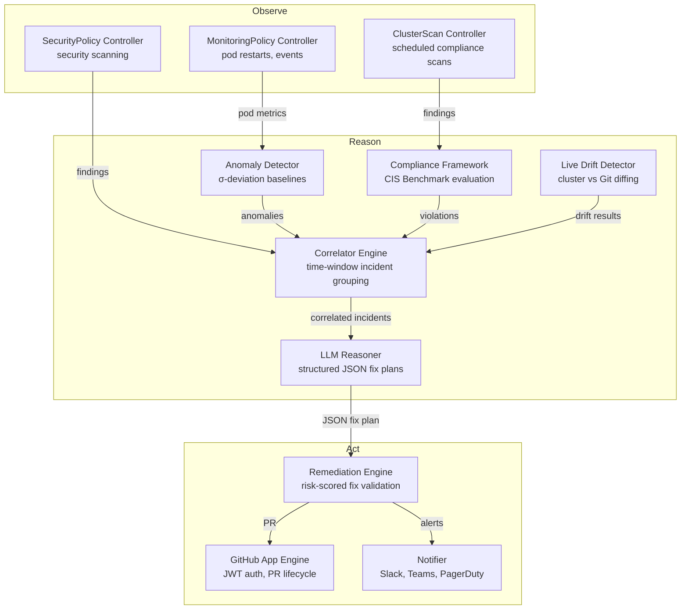

# Aotanami — Digital SRE & Security Engineer

Welcome to the **Aotanami Brain** documentation. While Aotanami is technically a Kubernetes Operator, its identity is that of a **Digital SRE and Security Engineer** — an agentic AI system that does the job of a full-time site reliability and security engineer, autonomously observing, reasoning, and acting on your clusters 24/7.

This document details the internal intelligence architecture.

## The Agentic Pipeline: Observe → Reason → Act



---

## Core Intelligence Components

### 1. Anomaly Detection (`internal/anomaly`)

The anomaly engine replaces static alert thresholds with **dynamic statistical baselines**.

| Feature | Implementation |
|---|---|
| **Baseline Learning** | Configurable learning period (default 24h) during which no anomalies are reported |
| **σ-Deviation Detection** | Triggers when a value exceeds `mean ± (sensitivity × σ)` from the sliding baseline |
| **Sliding Windows** | Maintains the last 1000 data points per metric key, pruning older values |
| **Severity Classification** | `medium` (≥ sensitivity σ), `high` (≥ 1.5× sensitivity σ), `critical` (≥ 2× sensitivity σ) |

**How the Digital SRE uses it:** The MonitoringPolicy controller feeds pod restart counts into the anomaly detector. When a restart spike deviates beyond 3σ from the baseline, it's ingested into the correlator as an `EventAnomaly`.

### 2. Incident Correlation (`internal/correlator`)

Security alerts in isolation are noise. The correlator **groups related signals into unified incidents**, just like a human SRE triaging a page.

| Feature | Implementation |
|---|---|
| **Time-Window Grouping** | Events for the same `namespace/resource` within a configurable window (default 5 min) are merged |
| **Severity Escalation** | Incident severity always escalates to the highest severity among its events |
| **Incident Lifecycle** | Each incident gets a unique ID (`INC-000001`), tracks open/resolved state |
| **Event Types** | `security_violation`, `anomaly`, `pod_crash`, `resource_exhaustion`, `config_drift` |

**How the Digital SRE uses it:** The SecurityPolicy controller and anomaly detector both feed events into the correlator. The RemediationPolicy controller queries open incidents for LLM diagnosis.

### 3. Remediation Engine (`internal/remediation`)

The remediation engine converts abstract findings into **concrete, validated Kubernetes fixes**.

| Feature | Implementation |
|---|---|
| **Structured LLM Output** | System prompt requests JSON with a precise schema: `{analysis, fixes[], risk_assessment, risk_score}` |
| **JSON Extraction** | `extractJSON()` handles raw JSON, markdown code blocks (` ```json `), and brace-matched extraction |
| **Graceful Fallback** | If the LLM returns unstructured text, wraps it as a single fix entry |
| **Risk Scoring** | LLM-provided score (0-100) when available, heuristic fallback based on severity + fix count |
| **Strategy Modes** | `dry-run` (log only), `auto-fix` (submit PR), `manual` (create but don't submit) |
| **Blast Radius Protection** | Hard limit on files changed per PR (default 20) |

### 4. GitHub App Engine (`internal/github`)

When operating in **Protect Mode**, Aotanami uses the GitHub App engine to autonomously fix your repositories. **Zero external dependencies** — implemented entirely with Go's standard library.

| Feature | Implementation |
|---|---|
| **JWT Authentication** | RS256-signed JWTs generated from the GitHub App private key (`crypto/rsa`, `crypto/sha256`) |
| **Token Management** | Installation access tokens are cached and auto-refreshed before expiry |
| **Authenticated Transport** | Custom `http.RoundTripper` auto-injects the `Authorization` header on all requests |
| **PR Lifecycle** | Creates branch → commits files → opens PR → applies labels |
| **File Operations** | Supports create, update, and delete file operations |

### 5. Compliance Framework (`internal/compliance`)

Maps security findings to industry compliance controls, generating **audit-ready reports with evidence**.

| Feature | Implementation |
|---|---|
| **CIS Kubernetes Benchmark** | 15 controls mapped to scanner rule types (pod-security, RBAC, secrets, etc.) |
| **Finding Evaluation** | `EvaluateFindings()` maps findings to controls via `RelatedRuleTypes`, attaches evidence |
| **Multi-Framework** | Architecture supports CIS, NIST 800-53, SOC 2, PCI-DSS, HIPAA, ISO 27001 |
| **ClusterScan Integration** | After every scan, evaluates CIS compliance and emits `ComplianceViolation` Kubernetes events |

### 6. Live Drift Detection (`internal/drift`)

Detects "ClickOps" — compares live Kubernetes state against Git-declared desired state.

| Feature | Implementation |
|---|---|
| **Recursive Object Diffing** | Deeply compares live and desired resource specs, field by field |
| **Ignored Fields** | Strips `.metadata.resourceVersion`, `.metadata.uid`, `.status`, managed fields |
| **Shadow Resources** | Detects resources existing in the cluster but not in Git (HTTP 404 from Git = shadow) |
| **9 Resource Types** | Deployment, StatefulSet, DaemonSet, Service, ConfigMap, Secret, NetworkPolicy, Role, RoleBinding |
| **Severity Classification** | Security-related fields (securityContext, hostNetwork) → high; RBAC → critical |

### 7. Notifier (`internal/notifier`)

Multi-channel alert delivery with production-grade reliability features.

| Feature | Implementation |
|---|---|
| **Channels** | Slack (Block Kit), Teams (Adaptive Cards), PagerDuty (Events API v2), generic webhooks |
| **Severity Filtering** | Each channel has a `MinSeverity` — low-severity alerts skip high-urgency channels |
| **Deduplication** | Alerts with the same `DeduplicationKey` are sent at most once within a cooldown window |
| **Rate Limiting** | Per-channel rate limiter prevents notification storms |

### 8. LLM Client (`internal/llm`)

The reasoning core. Built for resilient, cost-effective, 24/7 autonomous operation.

| Feature | Implementation |
|---|---|
| **Multi-Provider** | OpenRouter, OpenAI, Anthropic, Azure OpenAI, Ollama (local), Custom endpoints |
| **Circuit Breaker** | If a provider fails `N` times consecutively, stops sending requests for a cooldown period |
| **Exponential Backoff** | Automatic retries with configurable backoff (500ms → 10s) |
| **Token Budgeting** | Tracks prompt + completion tokens per request for cost control |
| **Prompt Cache** | Deduplicates identical requests to avoid redundant LLM calls |

---

## Controller Orchestration

The Digital SRE's autonomy lives in the **7 Kubernetes controllers** that wire the pipeline together:

| Controller | Observe | Reason | Act |
|---|---|---|---|
| `SecurityPolicy` | Scans pods for violations | Feeds findings into correlator | — |
| `MonitoringPolicy` | Watches pod restart counts | Feeds into anomaly detector → correlator | — |
| `RemediationPolicy` | — | Queries correlator for open incidents | Generates LLM plan → opens GitOps PR |
| `ClusterScan` | Runs scheduled security scans | Evaluates CIS compliance | Creates ScanReport CRs |
| `GitOpsRepository` | Discovers repo structure | — | Provides Git context for remediation |
| `CostPolicy` | Analyzes resource utilization | Identifies optimization opportunities | — |
| `AotanamiConfig` | — | — | Configures global settings |

---

## Operating Modes

### 🔍 Audit Mode (Default)
In this mode, the Digital SRE observes and reasons, but **does not act** on the cluster.
1. SecurityPolicy identifies vulnerabilities, MonitoringPolicy detects anomalies
2. Correlator groups related events into incidents
3. LLM generates root-cause analysis and suggested fix
4. Notifier routes the analysis to Slack, Teams, or PagerDuty
5. **No repository modifications or PRs are created.**

### 🛡️ Protect Mode
When a `GitOpsRepository` CRD is configured, the Digital SRE gains autonomy.
1. Correlator emits an incident
2. RemediationPolicy queries the LLM for a structured JSON fix plan
3. Remediation engine validates the plan and scores the risk
4. GitHub engine creates a branch, commits the fix, and opens a PR
5. Human team reviews and merges the PR
6. ArgoCD/Flux applies the change to the cluster

---

## Development Guidelines

When contributing to the Digital SRE's intelligence, follow these principles:

1. **Safety First:** We operate in production clusters. Always prefer the least disruptive fix. The remediation engine defaults to `dry-run` mode.
2. **Handle Transients:** Network flakes and API limits happen. Use exponential backoff and respect circuit breaker states.
3. **Pass Pointers for Large Structs:** As enforced by `golangci-lint` (gocritic), pass `*scanner.Finding`, `*correlator.Event`, etc. by pointer to avoid expensive copies.
4. **Rich Context, Low Tokens:** The LLM prompt must be surgical. Include only the YAML snippet and metric data needed for the diagnosis — not entire deployment manifests.
5. **Structured Output:** Always request JSON-structured output from the LLM. Use `extractJSON()` for robust parsing with fallback.
6. **Test Everything:** Every brain package has comprehensive test coverage. New features must include tests.
