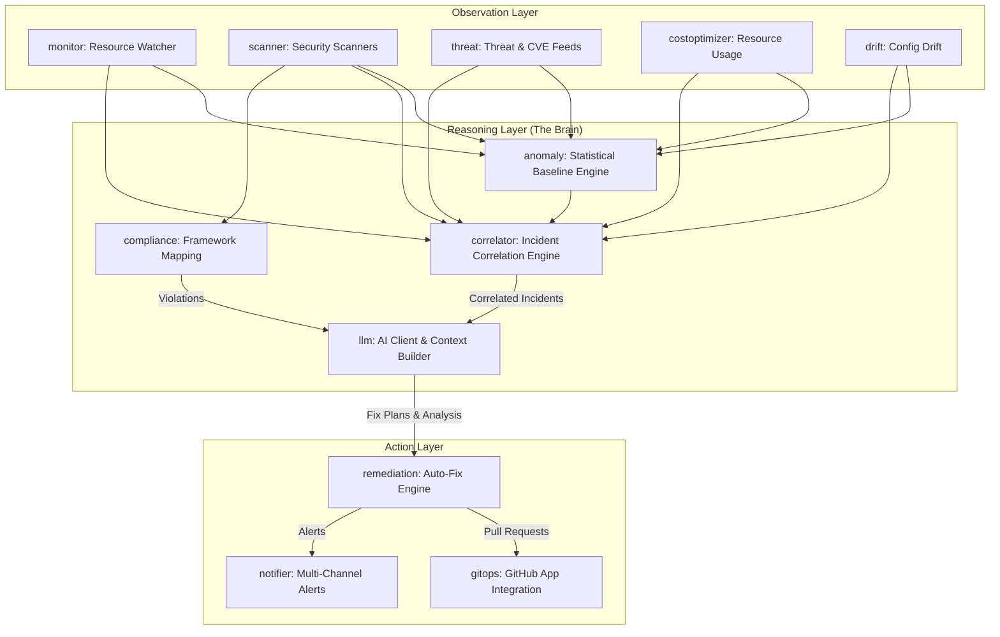

# Aotanami — Digital Employee & Agentic AI Guide

Welcome to the **Aotanami Digital Employee Brain** documentation. While Aotanami is built as a Kubernetes Operator, its true power lies in its "Agentic AI" capabilities — the ability to observe, correlate, reason, and autonomously remediate issues just like a human SRE or Security Engineer.

This document details the internal intelligence architecture built in Phase 2.

## The Brain Architecture (`internal/`)

The intelligence of Aotanami lives entirely within the `internal/` packages. These packages form the reasoning pipeline that converts raw Kubernetes telemetry into actionable GitOps Pull Requests.

---

## Core Agentic Components

### 1. Large Language Model Integration (`internal/llm`)
The LLM package is the reasoning core. It is built to be resilient, cost-effective, and safe for autonomous 24/7 operation.
- **BYO API Keys:** Supports OpenRouter, OpenAI, and Anthropic.
- **Resilience:** Implements automatic retries with exponential backoff and a **Circuit Breaker** pattern. If an LLM provider goes down or rate-limits aggressively, the circuit breaks to prevent log spam and endless retries, falling back to degraded (alert-only) mode.
- **Context Window Management:** Carefully tracks token usage to prevent blowing budgets or hitting context limits.

### 2. Auto-Remediation Engine (`internal/remediation`)
The remediation engine is responsible for converting an abstract security finding into a concrete, valid Kubernetes YAML patch.
- **Dry-Run Validation:** Before proposing a fix, it can dry-run the patch against against the apiserver to ensure it won't break the cluster.
- **Risk Scoring:** It calculates a numeric risk score (0-100) based on severity, blast radius, and the complexity of the proposed YAML changes.
- **Blast Radius Protection:** Hard limits on how many workloads a single automated PR can touch.

### 3. GitOps Automation (`internal/gitops`)
When operating in **Protect Mode**, Aotanami uses this package to autonomously fix your repositories.
- Authenticates securely via a **GitHub App installation** (no personal access tokens required).
- Clones target repositories, checks out fresh branches, applies the YAML patches generated by `remediation`, and opens fully formatted Pull Requests.
- Handles PR title standardization, branch name sanitization, and markdown evidence formatting.

### 4. Incident Correlation (`internal/correlator`)
Security alerts in isolation are noisy. The correlator groups related signals into holistic incidents.
- E.g., A `resource-limits` finding + `OOMKilled` pod event + `anomaly` spike in memory = A single correlated incident for the LLM to diagnose.

### 5. Anomaly Detection (`internal/anomaly`)
Traditional alerts rely on static thresholds. The anomaly engine builds dynamic baselines.
- Calculates moving averages and standard deviations for pod restart rates, API errors, and resource spikes.
- Uses sliding windows to differentiate between normal deployment spikes and true anomalous behavior.

### 6. Configuration Drift (`internal/drift`)
Detects "ClickOps". Compares the live Kubernetes Apiserver state against the declarative state defined in the GitOps repository. 
- Strips out dynamic Kubernetes fields (status, resourceVersion) to provide accurate diffs.

---

## Operating Modes

Aotanami's agentic loop operates in two distinct modes depending on your configuration:

### 🔍 Audit Mode (Default)
In this mode, the Brain observes and reasons, but **does not act**.
1. Identifies vulnerabilities or anomalies.
2. LLM generates a root-cause analysis and a suggested fix.
3. Information is routed via `internal/notifier` to Slack, Teams, or PagerDuty.
4. **No cluster modifications happen.**

### 🛡️ Protect Mode
When a `GitOpsRepository` CRD is configured, Aotanami gains autonomy.
1. Identifies vulnerabilities or anomalies.
2. LLM writes the raw YAML patch.
3. `internal/remediation` validates the patch.
4. `internal/gitops` checks out a branch on your IaC repo and opens a PR.
5. SRE team reviews the PR. Once merged, ArgoCD/Flux applies it to the cluster.

---

## Developing the Digital Employee

When contributing to Aotanami's intelligence, keep these principles in mind:

1. **Safety First:** We operate in production clusters. Always prioritize the "least disruptive fix."
2. **Handle Transients:** Network flakes and API limits happen. Always use `executeWithRetry` and respect Circuit Breaker states.
3. **Pass Pointers for Large Structs:** Our configurations are large. As enforced by `golangci-lint` (gocritic), always pass large structs like `scanner.Finding` and `monitor.Config` by pointer (`*`) to avoid expensive memory copies on every iteration.
4. **Rich Context, Low Tokens:** The LLM prompt builder must be surgical. Only include the exact YAML snippet and metric data needed for the decision, avoiding pasting entire multi-megabyte deployment manifests.
