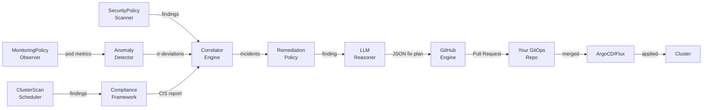
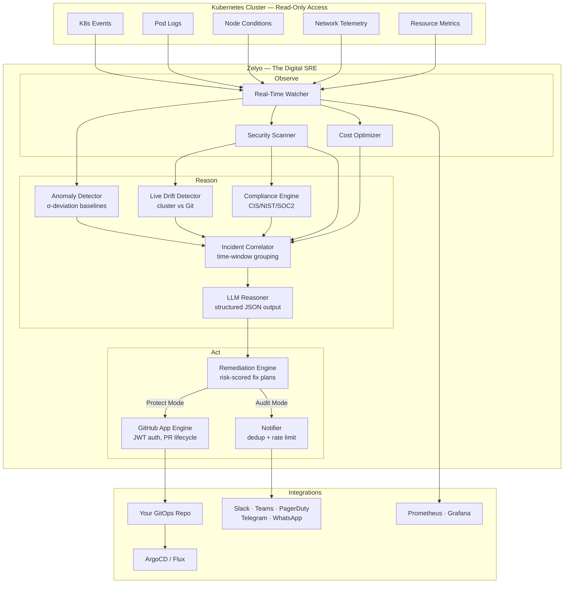

<p align="center">
  
</p>

<h1 align="center">Zelyo Operator</h1>

<p align="center">
  <strong>Your Digital SRE &amp; Security Engineer for Kubernetes</strong>
</p>
<p align="center">
  <em>An agentic AI operator that observes, reasons, and acts on your cluster — 24/7, just like a human engineer would.</em>
</p>
<p align="center">
  <a href="https://github.com/zelyo-ai/zelyo-operator/actions/workflows/ci.yml"></a>
  <a href="https://github.com/zelyo-ai/zelyo-operator/releases"></a>
  <a href="https://goreportcard.com/report/github.com/zelyo-ai/zelyo-operator"></a>
  <a href="LICENSE"></a>
  <a href="https://artifacthub.io/packages/helm/zelyo-ai/zelyo-operator"></a>
</p>

---

## What is Zelyo?

**Zelyo** is your **Digital SRE and Security Engineer** powered by **Agentic AI** that does the job of a full-time site reliability and security engineer. It doesn't just alert — it **observes**, **reasons**, and **acts**, continuously protecting your production clusters while you sleep.

The **Zelyo Operator** is a self-hosted Kubernetes Operator that allows you to manage and automate the lifecycle of Zelyo within your cluster.

Think of a seasoned SRE who:
- 👁️ **Watches** every pod restart, OOMKill, security misconfiguration, and RBAC drift
- 🧠 **Correlates** scattered signals into unified incidents (a restart spike + a CVE + a privilege escalation = one root cause)
- 🔬 **Diagnoses** issues using LLM-powered reasoning with full cluster context
- 🔧 **Fixes** problems by generating production-ready YAML patches and opening GitOps PRs
- 📋 **Reports** compliance posture against CIS Benchmarks, NIST 800-53, SOC 2, and PCI-DSS

That's Zelyo. All automated, all autonomous, all with **read-only cluster access**.

**Bring your own LLM API keys** (OpenRouter, OpenAI, Anthropic, Azure OpenAI, Ollama) — Zelyo is heavily optimized to minimize token usage.

### What a Digital SRE & Security Engineer Does

| Responsibility | How Zelyo Handles It |
|---|---|
| 🔒 **Security Scanning** | Continuously scans for RBAC issues, image CVEs, PodSecurity violations, secrets exposure, and network policy gaps |
| 🛡️ **Compliance Auditing** | Maps scan findings to CIS Kubernetes Benchmark controls, generates audit-ready reports with evidence |
| 🧠 **Anomaly Detection** | Builds σ-deviation baselines for pod restarts, resource usage, and error rates — detects anomalies without static thresholds |
| 🔗 **Incident Correlation** | Groups related events within time windows into unified incidents for LLM diagnosis — no more alert fatigue |
| 🔄 **Drift Detection** | Compares live cluster state against your Git repo, identifying shadow resources and ClickOps changes |
| 🤖 **Auto-Remediation** | LLM generates structured JSON fix plans, validates them, and opens GitOps PRs with risk scores |
| 💰 **Cost Optimization** | Detects idle workloads, recommends rightsizing, and assesses spot-instance readiness |
| 📢 **On-Call Notifications** | Routes alerts to Slack, Teams, PagerDuty, Telegram, WhatsApp, and webhooks with severity filtering and deduplication |
| 📊 **Observability** | Exposes Prometheus metrics, compliance percentages, and scan results — integrates with your existing Grafana dashboards |

### The Agentic Pipeline: Observe → Reason → Act

Unlike traditional scanning tools that dump findings and walk away, Zelyo operates as a **closed-loop autonomous agent**:



1. **Observe** — SecurityPolicy scans pods, MonitoringPolicy observes restart counts, ClusterScan evaluates compliance
2. **Correlate** — The correlator engine groups related events within a 5-minute window into unified incidents
3. **Reason** — The LLM analyzes the incident with full context and generates a structured JSON fix plan with risk score
4. **Act** — The remediation engine validates the plan, and the GitHub engine opens a PR with the fix
5. **Report** — Compliance reports, Kubernetes events, and Prometheus metrics flow to your dashboards

### Dual Operating Modes

| Mode | When | Behavior |
|---|---|---|
| **🔍 Audit Mode** (default) | No GitOps repo onboarded | Observes, diagnoses, and alerts — your Digital Security Analyst |
| **🛡️ Protect Mode** | GitOps repo onboarded | Full autonomous remediation — your Digital SRE on autopilot |

---

## Architecture



---

## Quick Start

### Install via Helm (OCI)

```bash
# Add your LLM API key as a Kubernetes secret
kubectl create secret generic zelyo-llm \
  --namespace zelyo-system \
  --from-literal=api-key=<YOUR_OPENROUTER_API_KEY>

# Install cert-manager (takes ~1m)
helm install cert-manager oci://quay.io/jetstack/charts/cert-manager \
  --version v1.20.0 \
  --namespace cert-manager \
  --create-namespace \
  --set crds.enabled=true

# Wait for cert-manager to be ready before installing the operator
kubectl wait --for=condition=Ready pods --all -n cert-manager --timeout=120s

# Install Zelyo Operator from OCI registry
helm install zelyo-operator oci://ghcr.io/zelyo-ai/charts/zelyo-operator \
  --namespace zelyo-system \
  --create-namespace \
  --set config.llm.provider=openrouter \
  --set config.llm.model=anthropic/claude-sonnet-4-20250514 \
  --set config.llm.apiKeySecret=zelyo-llm \
  --set webhook.certManager.enabled=true

# Verify the installation
kubectl get pods -n zelyo-system
```

### Verify Image Signature

```bash
cosign verify ghcr.io/zelyo-ai/zelyo-operator:<tag> \
  --certificate-identity-regexp='.*' \
  --certificate-oidc-issuer='https://token.actions.githubusercontent.com'
```

### Apply a Security Policy

```yaml
apiVersion: zelyo.ai/v1alpha1
kind: SecurityPolicy
metadata:
  name: enforce-non-root
  namespace: zelyo-system
spec:
  severity: critical
  match:
    namespaces: ["production", "staging"]
  rules:
    - type: container-security-context
      enforce: true
      autoRemediate: true
```

### Onboard a GitOps Repository (Activate Protect Mode)

```yaml
apiVersion: zelyo.ai/v1alpha1
kind: GitOpsRepository
metadata:
  name: my-infra-repo
  namespace: zelyo-system
spec:
  url: https://github.com/my-org/k8s-manifests
  branch: main
  paths:
    - "clusters/production/"
    - "clusters/staging/"
  provider: github
  authSecret: github-app-credentials
  syncStrategy: poll
```

### Enable Auto-Remediation

```yaml
apiVersion: zelyo.ai/v1alpha1
kind: RemediationPolicy
metadata:
  name: auto-fix-critical
  namespace: zelyo-system
spec:
  gitOpsRepository: my-infra-repo
  severityFilter: high        # Only fix high and critical findings
  dryRun: false               # Set to true to preview fixes without opening PRs
  maxConcurrentPRs: 3         # Limit blast radius
  autoMerge: false            # Require human approval
  prTemplate:
    titlePrefix: "[Zelyo Operator]"
    labels: ["zelyo-operator", "auto-remediation"]
    branchPrefix: "zelyo-operator/fix-"
```

---

## CRD Reference

Zelyo Operator uses **9 Custom Resource Definitions** to declaratively configure every aspect of the Digital SRE:

| CRD | Purpose |
|---|---|
| `ZelyoConfig` | Global configuration — LLM provider, API keys, feature flags |
| `SecurityPolicy` | Defines which security rules to scan for and which namespaces to target |
| `MonitoringPolicy` | Configures real-time monitoring — event filters, anomaly detection, alerts |
| `RemediationPolicy` | Controls auto-remediation — severity filter, dry-run, max PRs, GitOps target |
| `GitOpsRepository` | Onboards a Git repository for drift detection and PR submission |
| `ClusterScan` | Schedules cluster-wide security and compliance scans |
| `ScanReport` | Stores individual scan results (auto-created by ClusterScan) |
| `CostPolicy` | Configures cost optimization rules and thresholds |
| `NotificationChannel` | Configures alert delivery — Slack, Teams, PagerDuty, webhooks |

See [CRD Reference](docs/crd-reference.md) for complete field documentation.

---

## Internal Package Architecture

| Package | Role in the Digital SRE |
|---|---|
| `internal/scanner` | 8 security scanners (RBAC, images, PodSecurity, secrets, network, supply chain) |
| `internal/anomaly` | Statistical baseline engine — σ-deviation anomaly detection with sliding windows |
| `internal/correlator` | Time-windowed event correlation — groups alerts into unified incidents |
| `internal/compliance` | Maps findings to CIS/NIST/SOC2 controls, generates audit-ready reports |
| `internal/drift` | Live drift detector — compares cluster state vs Git with recursive object diffing |
| `internal/remediation` | LLM-powered fix generation with structured JSON output and risk scoring |
| `internal/llm` | Multi-provider LLM client with circuit breaker, retry, and token budgeting |
| `internal/github` | GitHub App engine — JWT auth, installation tokens, PR lifecycle (stdlib only) |
| `internal/gitops` | GitOps engine interface + ArgoCD/Flux/Kustomize/Helm source discovery |
| `internal/notifier` | Multi-channel notifications with severity filtering, dedup, and rate limiting |
| `internal/monitor` | Real-time Kubernetes resource watcher with event dispatch |
| `internal/controller` | 7 Kubernetes controllers orchestrating the Observe → Reason → Act pipeline |

---

## Development

### Prerequisites

- Go 1.24+
- Docker
- kubectl
- [kind](https://kind.sigs.k8s.io/) or [minikube](https://minikube.sigs.k8s.io/)
- [Kubebuilder](https://kubebuilder.io/)
- Helm 3.x

### Setup

```bash
# Clone the repository
git clone https://github.com/zelyo-ai/zelyo-operator.git
cd zelyo-operator

# Install dependencies
make install

# Generate manifests & CRDs
make manifests generate

# Run locally against a kind cluster
make run

# Run tests (14 packages, 60+ test cases)
make test

# Lint
make lint
```

### Build

```bash
# Build the binary
make build

# Build the Docker image
make docker-build IMG=ghcr.io/zelyo-ai/zelyo-operator:dev

# Build and push
make docker-push IMG=ghcr.io/zelyo-ai/zelyo-operator:dev
```

---

## Documentation

| Document | Description |
|---|---|
| [Getting Started](docs/getting-started.md) | Step-by-step setup: clone, cluster, first policy, first scan |
| [Quick Start Recipes](docs/quickstart.md) | Copy-paste YAML recipes for common use cases |
| [Architecture](docs/architecture.md) | System design, controllers, scanner engine, data flow |
| [Security Scanners](docs/scanners.md) | All 8 scanners: what they check, severity levels, example policies |
| [CRD Reference](docs/crd-reference.md) | Complete field reference for all 9 CRDs (spec + status) |
| [Monitoring & Metrics](docs/metrics.md) | Prometheus metrics, PromQL queries, Grafana dashboards, alerting rules |
| [LLM Configuration](docs/llm-configuration.md) | Provider setup, token budgets, and cost optimization |
| [GitOps Onboarding](docs/gitops-onboarding.md) | How to connect your GitOps repositories for auto-remediation |
| [Integrations](docs/integrations.md) | Notification channel setup guides (Slack, Teams, PagerDuty, etc.) |
| [Compliance](docs/compliance.md) | Supported frameworks and custom rule authoring |
| [Supply Chain Security](docs/supply-chain-security.md) | Verifying image signatures, SBOMs, and provenance |

---

## Contributing

We welcome contributions! Please see [CONTRIBUTING.md](CONTRIBUTING.md) for guidelines.

---

## Security

To report a security vulnerability, please see [SECURITY.md](SECURITY.md).

---

## License

Zelyo Operator is licensed under the [Apache License 2.0](LICENSE).

---

<p align="center">
  An Zelyo AI project. Originally created with ❤️ by <a href="https://zelyo.ai">Zelyo AI</a>
</p>
