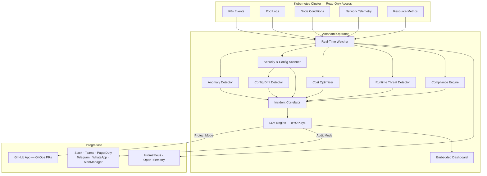

<p align="center">
  
</p>

<h1 align="center">Aotanami</h1>

<p align="center">
  <strong>Autonomous Kubernetes Protection — Powered by Agentic AI</strong>
</p>
<p align="center">
  <a href="https://github.com/aotanami/aotanami/actions/workflows/ci.yml"></a>
  <a href="https://github.com/aotanami/aotanami/releases"></a>
  <a href="https://goreportcard.com/report/github.com/aotanami/aotanami"></a>
  <a href="LICENSE"></a>
  <a href="https://artifacthub.io/packages/helm/aotanami/aotanami"></a>
</p>

---

## What is Aotanami?

Aotanami is a **self-hosted, lightweight Kubernetes Operator** that uses **Agentic AI** to provide complete **360° protection** for your production clusters. It autonomously detects security vulnerabilities, misconfigurations, cost anomalies, and runtime threats — then proposes **production-ready fixes via GitOps**, all with **read-only cluster access**.

**Bring your own LLM API keys** (OpenRouter, OpenAI, Anthropic) — Aotanami is heavily optimized to minimize token usage and keep your operational costs low.

### Key Features

| Category | Features |
|---|---|
| 🔒 **Security Scanning** | RBAC audit, image vulnerabilities, PodSecurity violations, secrets exposure, network policy gaps |
| 🛡️ **Compliance** | CIS Benchmarks, NSA/CISA hardening, PCI-DSS, SOC2, HIPAA compliance mapping |
| 🔗 **Supply Chain** | SBOM analysis, image signature verification (Cosign/Notary), base image CVE tracking |
| ⚡ **Real-Time Monitoring** | 24/7 Kubernetes events, pod logs, node conditions, network telemetry |
| 🧠 **Anomaly Detection** | Baseline learning, statistical drift detection, OOM/CrashLoop prediction |
| 🚨 **Runtime Threats** | Suspicious exec detection, privilege escalation, filesystem anomalies |
| 💰 **Cost Optimization** | Resource rightsizing, idle workload detection, spot-readiness assessment |
| 🔄 **Config Drift Detection** | Compares live cluster state against your GitOps repo manifests |
| 🤖 **Agentic AI Remediation** | LLM-powered diagnosis with production-ready fix PRs via GitHub App |
| 📊 **Built-in Dashboard** | Lightweight, real-time visualization — zero external dependencies |
| 📢 **Notifications** | AlertManager, PagerDuty, Slack, MS Teams, Telegram, WhatsApp, webhooks |
| 🌐 **Multi-Cluster** | Federation, aggregate views, cross-cluster correlation |

### Dual Operating Modes

| Mode | When | Behavior |
|---|---|---|
| **🔍 Audit Mode** (default) | No GitOps repo onboarded | Detects, diagnoses, and sends alerts — no cluster modifications |
| **🛡️ Protect Mode** | GitOps repo onboarded | Full autonomous remediation — generates fixes, opens PRs via GitHub App |

---

## Architecture



---

## Quick Start

### Install via Helm (OCI)

```bash
# Add your LLM API key as a Kubernetes secret
kubectl create secret generic aotanami-llm \
  --namespace aotanami-system \
  --from-literal=api-key=<YOUR_OPENROUTER_API_KEY>

# Install Aotanami from OCI registry
helm install aotanami oci://ghcr.io/aotanami/charts/aotanami \
  --namespace aotanami-system \
  --create-namespace \
  --set config.llm.provider=openrouter \
  --set config.llm.model=anthropic/claude-sonnet-4-20250514 \
  --set config.llm.apiKeySecret=aotanami-llm

# Verify the installation
kubectl get pods -n aotanami-system
```

### Verify Image Signature

```bash
cosign verify ghcr.io/aotanami/aotanami:<tag> \
  --certificate-identity-regexp='.*' \
  --certificate-oidc-issuer='https://token.actions.githubusercontent.com'
```

### Apply a Security Policy

```yaml
apiVersion: aotanami.com/v1alpha1
kind: SecurityPolicy
metadata:
  name: enforce-non-root
  namespace: aotanami-system
spec:
  severity: critical
  match:
    namespaces: ["production", "staging"]
  rules:
    - type: container-security-context
      enforce: true
      autoRemediate: true
```

### Onboard a GitOps Repository

```yaml
apiVersion: aotanami.com/v1alpha1
kind: GitOpsRepository
metadata:
  name: my-infra-repo
  namespace: aotanami-system
spec:
  url: https://github.com/my-org/k8s-manifests
  branch: main
  paths:
    - "clusters/production/"
    - "clusters/staging/"
  provider: github
  authSecret: github-app-credentials
  syncStrategy: poll
```

---

## Development

### Prerequisites

- Go 1.24+
- Docker
- kubectl
- [kind](https://kind.sigs.k8s.io/) or [minikube](https://minikube.sigs.k8s.io/)
- [Kubebuilder](https://kubebuilder.io/)
- Helm 3.x

### Setup

```bash
# Clone the repository
git clone https://github.com/aotanami/aotanami.git
cd aotanami

# Install dependencies
make install

# Generate manifests & CRDs
make manifests generate

# Run locally against a kind cluster
make run

# Run tests
make test

# Lint
make lint
```

### Build

```bash
# Build the binary
make build

# Build the Docker image
make docker-build IMG=ghcr.io/aotanami/aotanami:dev

# Build and push
make docker-push IMG=ghcr.io/aotanami/aotanami:dev
```

---

## Documentation

| Document | Description |
|---|---|
| [Getting Started](docs/getting-started.md) | Step-by-step setup: clone, cluster, first policy, first scan |
| [Quick Start Recipes](docs/quickstart.md) | Copy-paste YAML recipes for common use cases |
| [Architecture](docs/architecture.md) | System design, controllers, scanner engine, data flow |
| [Security Scanners](docs/scanners.md) | All 8 scanners: what they check, severity levels, example policies |
| [CRD Reference](docs/crd-reference.md) | Complete field reference for all 9 CRDs (spec + status) |
| [Monitoring & Metrics](docs/metrics.md) | Prometheus metrics, PromQL queries, Grafana dashboards, alerting rules |
| [LLM Configuration](docs/llm-configuration.md) | Provider setup, token budgets, and cost optimization |
| [GitOps Onboarding](docs/gitops-onboarding.md) | How to connect your GitOps repositories for auto-remediation |
| [Integrations](docs/integrations.md) | Notification channel setup guides (Slack, Teams, PagerDuty, etc.) |
| [Compliance](docs/compliance.md) | Supported frameworks and custom rule authoring |
| [Supply Chain Security](docs/supply-chain-security.md) | Verifying image signatures, SBOMs, and provenance |

---

## Contributing

We welcome contributions! Please see [CONTRIBUTING.md](CONTRIBUTING.md) for guidelines.

---

## Security

To report a security vulnerability, please see [SECURITY.md](SECURITY.md).

---

## License

Aotanami is licensed under the [Apache License 2.0](LICENSE).

---

<p align="center">
  An Aotanami Foundation project. Originally created with ❤️ by <a href="https://zelyo.ai">Zelyo AI</a>
</p>
