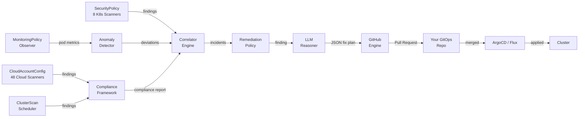
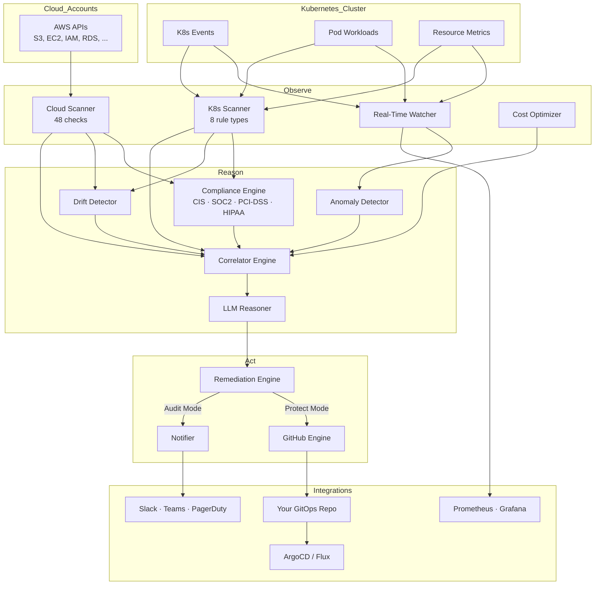

<p align="center">
  
</p>

<h1 align="center">Zelyo Operator</h1>

<p align="center">
  <strong>Open-Source CNAPP — Detect, Correlate, Fix</strong><br/>
  <sub>56 security scanners across Kubernetes and AWS cloud accounts. AI-powered correlation. Auto-generated GitOps PRs.</sub>
</p>

<p align="center">
  <a href="https://github.com/zelyo-ai/zelyo-operator/actions/workflows/ci.yml"></a>
  <a href="https://github.com/zelyo-ai/zelyo-operator/releases"></a>
  <a href="https://goreportcard.com/report/github.com/zelyo-ai/zelyo-operator"></a>
  <a href="LICENSE"></a>
  <a href="https://artifacthub.io/packages/helm/zelyo-ai/zelyo-operator"></a>
</p>

<p align="center">
  <a href="https://zelyo-ai.github.io/zelyo-operator/quickstart/">Quickstart</a> ·
  <a href="https://zelyo-ai.github.io/zelyo-operator/">Docs</a> ·
  <a href="https://github.com/zelyo-ai/zelyo-operator/issues/new?template=bug_report.md">Report Bug</a> ·
  <a href="https://github.com/zelyo-ai/zelyo-operator/issues/new?template=feature_request.md">Request Feature</a>
</p>

---

## What is Zelyo?

Zelyo is an open-source **Cloud-Native Application Protection Platform (CNAPP)** that runs as a Kubernetes operator. It continuously scans your Kubernetes workloads and cloud accounts, correlates findings with an LLM, and auto-generates code fixes as GitOps pull requests.

**What makes it different:** other tools detect. Zelyo detects AND fixes. Every remediation is a PR with a confidence score — human-reviewed, never applied directly.

### Capabilities

|                                   |                                                                                                                                                                                 |
| --------------------------------- | ------------------------------------------------------------------------------------------------------------------------------------------------------------------------------- |
| **56 Security Scanners**    | 8 Kubernetes (RBAC, images, PodSecurity, secrets, network, privilege escalation, security context, resource limits) + 48 cloud (CSPM, CIEM, Network, DSPM, Supply Chain, CI/CD) |
| **Multi-Cloud CNAPP**       | Onboard AWS accounts via `CloudAccountConfig` CRD with IRSA, Pod Identity, or static credentials                                                                              |
| **AI Correlation**          | LLM reasons over findings — overprivileged role + exposed service = attack chain                                                                                               |
| **GitOps Remediation**      | Auto-generates Kubernetes YAML patches and cloud IaC fixes (Terraform/CloudFormation), opens PRs                                                                                |
| **6 Compliance Frameworks** | CIS Kubernetes Benchmark, NIST 800-53, SOC 2, PCI-DSS, HIPAA, ISO 27001                                                                                                         |
| **Anomaly Detection**       | Builds statistical baselines for pod restarts, resource usage, and error rates                                                                                                  |
| **Drift Detection**         | Compares live cluster state against your Git repo                                                                                                                               |
| **Cost Optimization**       | Detects idle workloads, recommends rightsizing                                                                                                                                  |
| **Notifications**           | Slack, Teams, PagerDuty, Telegram, WhatsApp, webhooks, email                                                                                                                    |
| **Production-Safe**         | Read-only cluster access. Non-destructive by design.                                                                                                                            |

---

## The Pipeline: Detect → Correlate → Fix



1. **Detect** — SecurityPolicy scans Kubernetes pods, CloudAccountConfig scans cloud accounts, MonitoringPolicy watches for anomalies, ClusterScan evaluates compliance
2. **Correlate** — Groups related signals within a time window into unified findings
3. **Fix** — LLM generates a confidence-scored JSON fix plan, remediation engine validates it, GitHub engine opens a PR

### Operating Modes

| Mode                          | Behavior                                                                                |
| ----------------------------- | --------------------------------------------------------------------------------------- |
| **Audit** *(default)* | Detects, correlates, and alerts. The remediation engine runs in `dry-run` — fix plans are logged but no PRs are opened. |
| **Protect**             | Switches the remediation engine to the `gitops-pr` strategy. PRs are opened only when at least one `RemediationPolicy` CR points at a configured `GitOpsRepository`. The policy's `severityFilter` decides which incidents qualify, and `maxConcurrentPRs` caps the number of open Zelyo PRs on the target repo. |

> **Note:** `ZelyoConfig.spec.mode: protect` by itself does not produce any PRs — it only authorizes the pipeline. See [Enable GitOps Remediation](docs/quickstart.md#enable-gitops-remediation) for the full `GitOpsRepository` + `RemediationPolicy` setup.

---

## Installation

> **Pin a chart version.** The charts are published to an OCI registry, which has no "latest" alias — `helm install` requires `--version`. Find the current tag at [github.com/zelyo-ai/zelyo-operator/releases](https://github.com/zelyo-ai/zelyo-operator/releases) and substitute it below.

```bash
# Use the latest release tag from https://github.com/zelyo-ai/zelyo-operator/releases
ZELYO_VERSION=1.0.0-alpha3

# 1. Install Zelyo Operator
helm install zelyo-operator oci://ghcr.io/zelyo-ai/charts/zelyo-operator \
  --version "$ZELYO_VERSION" \
  --namespace zelyo-system \
  --create-namespace \
  --set config.llm.provider=openrouter \
  --set config.llm.model=anthropic/claude-sonnet-4-20250514 \
  --set config.llm.apiKeySecret=zelyo-llm

# 2. Add your LLM API key (operator auto-activates within seconds)
kubectl create secret generic zelyo-llm \
  --namespace zelyo-system \
  --from-literal=api-key=<YOUR_API_KEY>

# 3. Deploy default security policies
helm install zelyo-policies oci://ghcr.io/zelyo-ai/charts/zelyo-policies \
  --version "$ZELYO_VERSION" \
  --namespace zelyo-system

# 4. Verify
kubectl get pods -n zelyo-system
kubectl get securitypolicies,clusterscans,monitoringpolicies -n zelyo-system
```

Step 3 deploys the `zelyo-policies` chart with production-ready defaults: 3 tiered SecurityPolicies (production/staging/default), nightly + weekly ClusterScans, MonitoringPolicy with anomaly detection, and CIS compliance evaluation. Override the profile with `--set global.profile=strict` for regulated environments, or enable additional compliance frameworks with `--set compliance.presets.soc2=true`.

Webhook TLS uses self-signed certificates by default. To use cert-manager instead, add `--set webhook.certManager.enabled=true` and install cert-manager first.

Supported LLM providers: OpenRouter, OpenAI, Anthropic, Azure OpenAI, Ollama.

### Verify Image Signature

```bash
cosign verify ghcr.io/zelyo-ai/zelyo-operator:<tag> \
  --certificate-identity-regexp='.*' \
  --certificate-oidc-issuer='https://token.actions.githubusercontent.com'
```

See the [Quickstart Guide](docs/quickstart.md) for a complete walkthrough including local cluster setup, all CRD recipes, and cloud account onboarding.

---

## Quick Examples

### Scan Kubernetes Workloads

```yaml
apiVersion: zelyo.ai/v1alpha1
kind: SecurityPolicy
metadata:
  name: enforce-non-root
  namespace: zelyo-system
spec:
  severity: critical
  match:
    namespaces: ["production", "staging"]
  rules:
    - name: security-context
      type: container-security-context
      enforce: true
    - name: pod-security
      type: pod-security
      enforce: true
```

### Scan an AWS Account

```yaml
apiVersion: zelyo.ai/v1alpha1
kind: CloudAccountConfig
metadata:
  name: aws-prod
  namespace: zelyo-system
spec:
  provider: aws
  accountID: "123456789012"
  regions: ["us-east-1", "us-west-2"]
  credentials:
    method: irsa
    roleARN: "arn:aws:iam::123456789012:role/ZelyoReadOnly"
  scanCategories: ["cspm", "ciem", "network", "dspm"]
  complianceFrameworks: ["soc2", "pci-dss"]
```

### Enable Auto-Remediation

```yaml
apiVersion: zelyo.ai/v1alpha1
kind: GitOpsRepository
metadata:
  name: infra-repo
  namespace: zelyo-system
spec:
  url: https://github.com/my-org/k8s-manifests
  branch: main
  paths: ["clusters/production/"]
  provider: github
  authSecret: github-creds
  enableDriftDetection: true
---
apiVersion: zelyo.ai/v1alpha1
kind: RemediationPolicy
metadata:
  name: auto-fix
  namespace: zelyo-system
spec:
  gitOpsRepository: infra-repo
  severityFilter: high
  dryRun: false
  maxConcurrentPRs: 3
  autoMerge: false
  prTemplate:
    titlePrefix: "[Zelyo Auto-Fix]"
    labels: ["security", "automated"]
    branchPrefix: "zelyo-operator/fix-"
```

---

## CRDs

Zelyo Operator uses **10 Custom Resource Definitions**:

| CRD                     | Purpose                                                                       |
| ----------------------- | ----------------------------------------------------------------------------- |
| `ZelyoConfig`         | Global config — LLM provider, API keys, operating mode, token budget         |
| `SecurityPolicy`      | Kubernetes workload security rules and namespace targeting                    |
| `CloudAccountConfig`  | Cloud account onboarding (AWS) for multi-cloud scanning                       |
| `ClusterScan`         | Scheduled cluster-wide scans with history retention                           |
| `ScanReport`          | Immutable scan results (auto-created by ClusterScan / CloudAccountConfig)     |
| `MonitoringPolicy`    | Real-time event monitoring and anomaly detection                              |
| `RemediationPolicy`   | Auto-remediation config — severity filter, dry-run, max PRs                  |
| `GitOpsRepository`    | Repository onboarding for drift detection and PR submission                   |
| `CostPolicy`          | Cost optimization — idle detection, rightsizing, budget alerts               |
| `NotificationChannel` | Alert routing — Slack, Teams, PagerDuty, Telegram, WhatsApp, webhooks, email |

See [CRD Reference](docs/crd-reference.md) for complete field documentation.

---

## Architecture



<details>
<summary><strong>Internal Package Map</strong></summary>

| Package                   | Role                                                                                    |
| ------------------------- | --------------------------------------------------------------------------------------- |
| `internal/scanner`      | 8 Kubernetes security scanners + registry                                               |
| `internal/cloudscanner` | 48 cloud scanners (CSPM, CIEM, Network, DSPM, Supply Chain, CI/CD) + AWS client factory |
| `internal/anomaly`      | Statistical baseline engine with sliding-window deviation detection                     |
| `internal/correlator`   | Time-windowed event correlation                                                         |
| `internal/compliance`   | Maps findings to CIS/NIST/SOC2/PCI-DSS/HIPAA/ISO27001 controls                          |
| `internal/drift`        | Live drift detector — cluster state vs Git                                             |
| `internal/remediation`  | LLM-powered fix generation with structured JSON output                                  |
| `internal/llm`          | Multi-provider LLM client with circuit breaker and token budgeting                      |
| `internal/github`       | GitHub App engine — JWT auth, PR lifecycle                                             |
| `internal/gitops`       | GitOps engine interface + ArgoCD/Flux/Kustomize/Helm discovery                          |
| `internal/notifier`     | Multi-channel notifications with dedup and rate limiting                                |
| `internal/monitor`      | Real-time Kubernetes resource watcher                                                   |
| `internal/controller`   | 10 controllers orchestrating the Detect → Correlate → Fix pipeline                    |

</details>

---

## Development

### Prerequisites

- Go 1.26+
- Docker
- kubectl
- [k3d](https://k3d.io/) or [kind](https://kind.sigs.k8s.io/)
- Helm 3.x

### Build & Test

```bash
git clone https://github.com/zelyo-ai/zelyo-operator.git
cd zelyo-operator

make generate manifests   # Generate DeepCopy and CRD YAML
make build                # Build binary
make test                 # Run tests (15 packages)
make lint                 # golangci-lint with 30+ linters
make docker-build IMG=ghcr.io/zelyo-ai/zelyo-operator:dev
```

---

## Documentation

| Document                                            | Description                                            |
| --------------------------------------------------- | ------------------------------------------------------ |
| [Quickstart](docs/quickstart.md)                       | Local cluster setup, all CRD recipes, cloud onboarding |
| [Architecture](docs/architecture.md)                   | System design, controllers, data flow                  |
| [Scanners](docs/scanners.md)                           | All 56 scanners — what they check, severity levels    |
| [CRD Reference](docs/crd-reference.md)                 | Complete field reference for all 10 CRDs               |
| [Compliance](docs/compliance.md)                       | Supported frameworks and control mappings              |
| [Metrics](docs/metrics.md)                             | Prometheus metrics, PromQL queries, alerting rules     |
| [LLM Configuration](docs/llm-configuration.md)         | Provider setup and token budgets                       |
| [GitOps Onboarding](docs/gitops-onboarding.md)         | Repository connection for auto-remediation             |
| [Integrations](docs/integrations.md)                   | Notification channel setup (Slack, Teams, PagerDuty)   |
| [Supply Chain Security](docs/supply-chain-security.md) | Image signatures, SBOMs, provenance                    |

---

## Contributing

We welcome contributions! See [CONTRIBUTING.md](CONTRIBUTING.md) for guidelines.

## Security

To report a vulnerability, see [SECURITY.md](SECURITY.md).

## License

Apache License 2.0 — see [LICENSE](LICENSE).

---

<p align="center">
  <sub>Built by <a href="https://zelyo.ai">Zelyo AI</a></sub>
</p>
