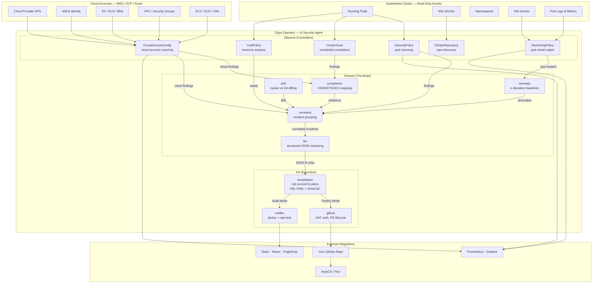
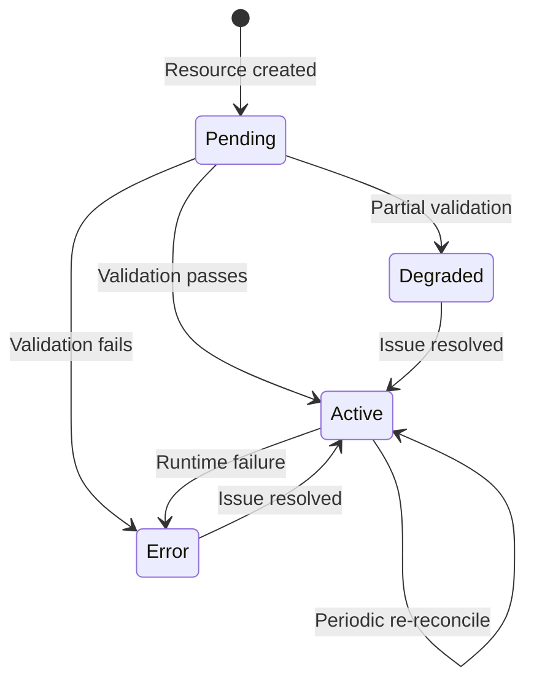

# Architecture

## Overview

Zelyo Operator is your **AI Security Agent** — a Kubernetes Operator built with [Kubebuilder](https://kubebuilder.io/) that autonomously **detects**, **correlates**, and **fixes** security misconfigurations in your production clusters and cloud accounts (AWS, GCP, Azure). Non-destructive by design. Production-safe by default. Every decision logged and auditable.

## How It Works: Detect → Correlate → Fix

```
SecurityPolicy scans pods    →  Correlator groups signals  →  LLM generates fix plan   →  GitHub PR with fix
CloudAccountConfig scans cloud →  Compliance framework maps  →  into unified findings     →  or Slack/PagerDuty alert
MonitoringPolicy watches     →  Anomaly detector fires     →                            →
ClusterScan evaluates CIS    →  Compliance framework maps  →                            →
```

1. **You declare intent** by creating CRDs like `SecurityPolicy`, `CloudAccountConfig`, `MonitoringPolicy`, or `ClusterScan`
2. **Zelyo detects** — scanning pods across 7 security layers, scanning cloud accounts across 6 categories (CSPM, CIEM, Network, DSPM, Supply Chain, CI/CD), watching for anomalies, evaluating compliance
3. **The brain correlates** — anomaly detector builds baselines, correlator groups events into security findings (e.g., overprivileged IAM role + public S3 bucket = data exfiltration risk), LLM generates confidence-scored fix plans
4. **The engine fixes** — remediation engine validates fixes (Kubernetes YAML or cloud IaC like Terraform/CloudFormation), GitHub engine opens production-safe PRs, notifier routes alerts
5. **It never stops** — continuous reconciliation catches new violations, drift, and anomalies across both Kubernetes and cloud

## System Architecture



## The AI Security Brain (`internal/`)

The intelligence lives entirely within the `internal/` packages. These form the autonomous pipeline that converts raw Kubernetes security signals into actionable GitOps Pull Requests.

### Observe Layer

| Package | What the Security Agent Detects |
|---|---|
| `scanner` | 8 Kubernetes scanners — RBAC, container security, images, PodSecurity, secrets, network, privilege escalation, resource limits |
| `cloudscanner` | 48 cloud security scanners across CSPM, CIEM, Network Security, DSPM, Supply Chain, and CI/CD Pipeline categories (AWS SDK v2 with IRSA, Workload Identity, Pod Identity) |
| `monitor` | Real-time Kubernetes resource watcher with event dispatch |
| `costoptimizer` | Resource utilization analysis — idle workloads, rightsizing, spot readiness |

### Reason Layer

| Package | How the Security Agent Correlates |
|---|---|
| `anomaly` | Statistical baseline engine — σ-deviation detection with sliding windows (1000 data points per metric) |
| `correlator` | Time-windowed event grouping — merges security findings + anomalies + crashes into unified incidents |
| `compliance` | Maps findings to CIS Kubernetes Benchmark controls (15 controls) with evidence attachment |
| `drift` | Live drift detector — recursive object diffing across 9 resource types, shadow resource detection |
| `llm` | Multi-provider LLM client — OpenRouter, OpenAI, Anthropic, Azure, Ollama with circuit breaker + retry |

### Act Layer

| Package | How the Security Agent Fixes |
|---|---|
| `remediation` | LLM-powered fix generation — structured JSON output for K8s YAML and cloud IaC (Terraform/CloudFormation), risk scoring (0-100), blast radius protection |
| `github` | GitHub App engine — RS256 JWT auth, token caching, branch → commit → PR → label lifecycle (stdlib only) |
| `gitops` | GitOps interface + ArgoCD/Flux/Kustomize/Helm source discovery |
| `notifier` | Multi-channel delivery — Slack, Teams, PagerDuty, webhooks with severity filtering + deduplication |

## Controllers — The Security Agent's Responsibilities

| Controller | Detect | Correlate | Fix |
|---|---|---|---|
| **SecurityPolicy** | Scans pods for violations | Feeds findings → correlator | — |
| **CloudAccountConfig** | Scans cloud accounts across 6 categories | Feeds cloud findings → compliance + correlator | Creates ScanReport CRs, emits ComplianceViolation events |
| **MonitoringPolicy** | Watches pod restart counts | Feeds → anomaly detector → correlator | — |
| **ClusterScan** | Runs scheduled scans | Evaluates CIS compliance | Creates ScanReport CRs, emits ComplianceViolation events |
| **RemediationPolicy** | — | Queries correlator for open incidents | LLM plan → validates → opens GitOps PR (K8s YAML or cloud IaC) |
| **GitOpsRepository** | Discovers repo structure | — | Provides Git context for remediation |
| **CostPolicy** | Analyzes resource utilization | Identifies waste | — |
| **ZelyoConfig** | — | — | Configures global settings |

### Controller Lifecycle

Every controller follows the standard lifecycle pattern:



## Scanner Engine

The scanner engine is **pluggable** — each scanner registers by rule type, and controllers look them up from a shared registry.

```
SecurityPolicy.spec.rules[].type  →  Registry.Get(type)  →  scanner.Scan(pods)  →  []Finding
```

### Kubernetes Scanners (8)

| Scanner | Rule Type | What It Checks |
|---|---|---|
| **Container Security Context** | `container-security-context` | runAsNonRoot, privileged, readOnlyRootFilesystem, allowPrivilegeEscalation |
| **Resource Limits** | `resource-limits` | Missing CPU/memory requests and limits |
| **Image Pinning** | `image-vulnerability` | `:latest` tags, missing digest pins |
| **Pod Security** | `pod-security` | hostNetwork, hostPID, hostIPC, hostPath, SYS_ADMIN, NET_RAW |
| **Privilege Escalation** | `privilege-escalation` | Root UID, auto-mounted tokens, unmasked /proc |
| **Secrets Exposure** | `secrets-exposure` | Hardcoded secrets in env vars, sensitive patterns |
| **Network Policy** | `network-policy` | Unlabeled pods, hostPort usage |
| **RBAC Audit** | `rbac-audit` | Default service account usage, admin-named SAs |

### Cloud Scanners (48)

| Category | Checks | What It Covers |
|---|---|---|
| **CSPM** | 8 | Public S3 buckets, unencrypted EBS, CloudTrail, RDS encryption, KMS rotation, VPC Flow Logs, S3 versioning, Secrets Manager |
| **CIEM** | 8 | Overprivileged IAM, unused access keys, root account keys, wildcard permissions, cross-account trust, inactive users, MFA enforcement, long-lived keys |
| **Network Security** | 8 | SSH/RDP open to internet, database ports, NACLs, VPC peering, ALB HTTPS, default security groups, unrestricted egress |
| **DSPM** | 8 | S3 public ACLs, encryption, DynamoDB encryption, RDS public access, EBS snapshot exposure, CloudWatch encryption, Object Lock, data classification |
| **Supply Chain** | 8 | ECR CVEs, scan-on-push, stale base images, hardcoded secrets, unsigned images, third-party CVEs, SBOM, unscanned images |
| **CI/CD Pipeline** | 8 | Hardcoded secrets, unencrypted artifacts, plaintext env secrets, manual approval gates, overprivileged builds, unmanaged images, audit logging |

## Status Conditions

Every resource uses **Kubernetes-standard status conditions**:

| Condition | Meaning |
|---|---|
| `Ready` | Fully reconciled and operational |
| `SecretResolved` | Referenced K8s Secret is accessible |
| `ScanCompleted` | Security scan finished |
| `GitOpsConnected` | GitOps repository available |

## Prometheus Metrics

| Metric | Type | What It Tracks |
|---|---|---|
| `zelyo_operator_controller_reconcile_total` | Counter | Reconcile operations per controller |
| `zelyo_operator_controller_reconcile_duration_seconds` | Histogram | Reconcile latency |
| `zelyo_operator_scanner_findings_total` | Counter | Findings by scanner and severity |
| `zelyo_operator_scanner_resources_scanned_total` | Counter | Total resources scanned |
| `zelyo_operator_policy_violations` | Gauge | Current violations per policy |
| `zelyo_operator_clusterscan_completed_total` | Counter | Completed cluster scans |
| `zelyo_operator_clusterscan_findings` | Gauge | Findings from last scan |
| `zelyo_operator_cost_rightsizing_recommendations` | Gauge | Pending rightsizing recommendations |
| `zelyo_operator_cloudscan_completed_total` | Counter | Completed cloud scans per account/provider |
| `zelyo_operator_cloudscan_findings` | Gauge | Findings from last cloud scan per category |
| `zelyo_operator_cloudscan_resources_scanned_total` | Counter | Total cloud resources scanned |
| `zelyo_operator_cloudscan_scan_duration_seconds` | Histogram | Cloud scan duration per provider/category |

## Security Model

- **Read-only cluster access**: Only `get`, `list`, `watch` verbs on cluster resources
- **No direct mutations**: All fixes delivered as GitOps PRs, never applied directly
- **API key isolation**: LLM keys in Kubernetes Secrets, never logged
- **Non-root container**: UID 65532, `scratch` image, read-only rootfs
- **Signed artifacts**: Cosign-signed images with SBOM attestations
- **Admission webhooks**: Validates SecurityPolicy resources before persistence

## Project Layout

```
zelyo-operator/
├── api/v1alpha1/           # CRD type definitions (10 types + conditions)
├── cmd/main.go             # Entrypoint — wires controllers, brain, scanners
├── config/                 # Kustomize manifests (CRDs, RBAC, webhook, samples)
├── internal/
│   ├── controller/         # 10 controllers (Detect → Correlate → Fix)
│   ├── scanner/            # 8 Kubernetes security scanners + registry
│   ├── cloudscanner/       # 48 cloud security scanners (CSPM, CIEM, Network, DSPM, Supply Chain, CI/CD)
│   ├── anomaly/            # σ-deviation baseline engine
│   ├── correlator/         # Time-windowed incident correlation
│   ├── compliance/         # CIS/NIST/SOC2 framework mapping
│   ├── drift/              # Live cluster-vs-Git drift detection
│   ├── remediation/        # LLM-powered fix generation + risk scoring
│   ├── llm/                # Multi-provider LLM client + circuit breaker
│   ├── github/             # GitHub App engine (stdlib only)
│   ├── gitops/             # GitOps interface + source discovery
│   ├── notifier/           # Multi-channel notifications
│   ├── monitor/            # Real-time resource watcher
│   ├── conditions/         # Status condition helpers
│   ├── metrics/            # Prometheus metrics
│   └── webhook/            # Admission webhook
├── charts/                 # Helm chart
├── test/                   # E2E tests
└── docs/                   # Documentation
```
