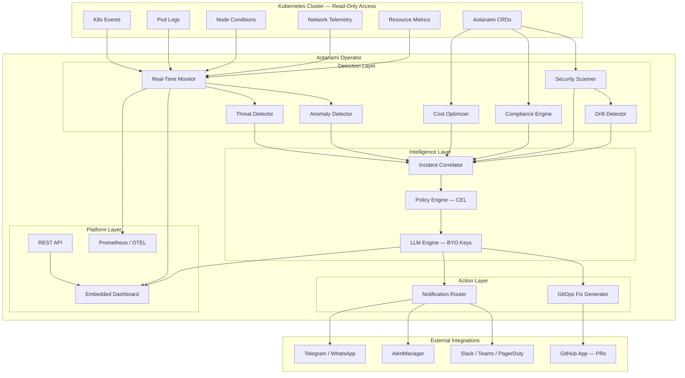
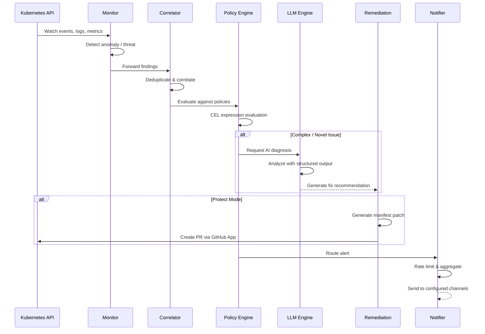
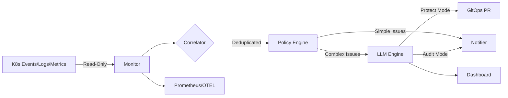

# Aotanami Architecture

## Overview

Aotanami is a Kubernetes Operator built with [Kubebuilder](https://kubebuilder.io/) and [controller-runtime](https://github.com/kubernetes-sigs/controller-runtime). It runs as a single deployment in your cluster with **read-only access** to cluster resources, using **Agentic AI** (BYO LLM keys) to autonomously detect, diagnose, and remediate issues via GitOps.

## System Architecture

## Operator Lifecycle

## Core Components

### Controllers (Kubebuilder-generated)

Each CRD has a dedicated reconciliation controller:

| Controller | Watches | Reconciles |
|---|---|---|
| SecurityPolicyReconciler | SecurityPolicy | Configures scanner rules, triggers evaluations |
| RemediationPolicyReconciler | RemediationPolicy | Manages GitOps PR generation settings |
| ClusterScanReconciler | ClusterScan | Schedules and executes scans |
| ScanReportReconciler | ScanReport | Manages scan result lifecycle |
| CostPolicyReconciler | CostPolicy | Configures cost monitoring thresholds |
| MonitoringPolicyReconciler | MonitoringPolicy | Configures real-time monitoring |
| NotificationChannelReconciler | NotificationChannel | Validates and activates notification channels |
| AotanamiConfigReconciler | AotanamiConfig | Applies global configuration changes |
| GitOpsRepositoryReconciler | GitOpsRepository | Onboards repos, manages sync lifecycle |

### Internal Packages

| Layer | Package | Purpose |
|---|---|---|
| Intelligence | `llm` | BYO LLM client with token optimization |
| Intelligence | `anomaly` | Statistical anomaly detection |
| Intelligence | `correlator` | Incident dedup & correlation |
| Intelligence | `policy` | CEL-based policy evaluation |
| Detection | `monitor` | Real-time K8s event/log watcher |
| Detection | `scanner` | Security & config scanning |
| Detection | `compliance` | CIS, NSA, PCI-DSS, SOC2, HIPAA |
| Detection | `supplychain` | SBOM, image signatures, CVEs |
| Detection | `threat` | Runtime threat detection |
| Detection | `drift` | Config drift vs. GitOps repo |
| Detection | `costoptimizer` | Resource rightsizing & cost analysis |
| Actions | `remediation` | GitOps fix generator |
| Actions | `gitops` | Repo onboarding & sync |
| Actions | `github` | GitHub App client |
| Actions | `notifier` | Multi-channel alert routing |
| Platform | `dashboard` | Embedded web UI (htmx + SSE) |
| Platform | `api` | REST API (OpenAPI) |
| Platform | `metrics` | Prometheus + OTEL export |
| Platform | `multicluster` | Cross-cluster federation |

## Data Flow

## Security Model

- **Read-only cluster access**: Aotanami uses only `get`, `list`, `watch` verbs on cluster resources
- **No direct mutations**: All fixes are delivered as GitOps PRs, never applied directly
- **API key isolation**: LLM API keys stored in Kubernetes Secrets, never logged or exposed
- **Non-root container**: Runs as UID 65532 in a distroless image with read-only rootfs
- **Signed artifacts**: All container images and Helm charts are Cosign-signed with SBOM attestations
