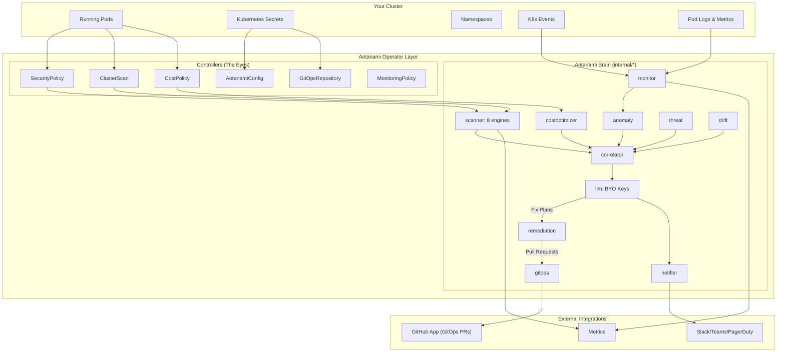
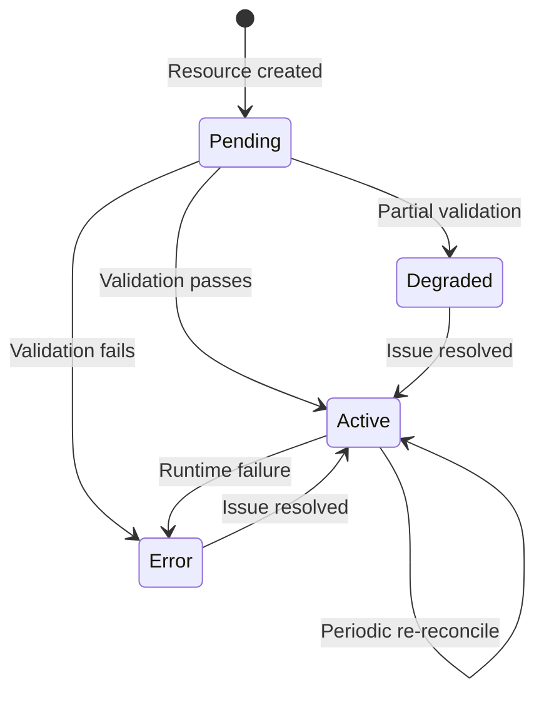

# Architecture

## Overview

Aotanami is a Kubernetes Operator built with [Kubebuilder](https://kubebuilder.io/) and [controller-runtime](https://github.com/kubernetes-sigs/controller-runtime). It runs as a single deployment in your cluster, continuously scanning workloads for security misconfigurations, compliance violations, and cost optimization opportunities.

**Think of it as a security guard that never sleeps** — it watches your Kubernetes pods around the clock and reports anything that looks wrong.

## How It Works (The Simple Version)

```
You create a SecurityPolicy     →    Aotanami scans pods    →    Findings appear in status
         (what to check)               (automatically)            (what it found)
```

1. **You tell Aotanami what to check** by creating Custom Resources (CRDs) like `SecurityPolicy` or `ClusterScan`
2. **Aotanami watches your pods** and runs security scanners against them
3. **Results show up** in the resource's `.status` field, as Kubernetes Events, and in Prometheus metrics
4. **It keeps checking** — scanners re-run periodically to catch new violations

## System Architecture



## The Digital Employee Brain (Phase 2)

Aotanami's true power goes beyond simple static scanning. The operator contains a full embedded intelligence pipeline designed to autonomously operate your cluster:

1. **LLM Engine (`internal/llm`)**: Built-in support for OpenRouter, Anthropic, and OpenAI with token budgeting, exponential backoff retries, and circuit breakers for production resilience.
2. **Incident Correlation (`internal/correlator`)**: Correlates isolated security findings and anomalous metrics into holistic incidents, drastically reducing alert fatigue.
3. **Auto-Remediation (`internal/remediation`)**: Analyzes structured findings and uses the LLM to generate precise, syntactically-valid Kubernetes YAML patches to fix the issue.
4. **GitOps Automation (`internal/gitops`)**: Uses a GitHub App integration to securely check out your infrastructure repository, apply the generated YAML fixes, and open fully-documented Pull Requests.
5. **Multi-Channel Notifier (`internal/notifier`)**: Smart alerting to Slack, Microsoft Teams, PagerDuty, webhooks, and email, with rate limiting and deduplication.

This pipeline effectively acts as a tireless, 24/7 Security/SRE engineer that identifies issues and proposes the code to fix them.

## Controllers — What Each One Does

Aotanami has **9 controllers**, each responsible for one type of Custom Resource:

| Controller | What It Does | Key Behaviors |
|---|---|---|
| **AotanamiConfig** | Manages global operator settings | Enforces singleton (only one allowed), validates LLM API key secret exists |
| **SecurityPolicy** | Scans pods for security violations | Targets pods by namespace/labels, runs scanners, filters by severity |
| **ClusterScan** | Runs scheduled cluster-wide scans | Creates ScanReport children, enforces history limits, supports suspension |
| **ScanReport** | Manages scan result lifecycle | Created by ClusterScan, stores findings as queryable K8s resources |
| **MonitoringPolicy** | Validates monitoring configuration | Checks that referenced NotificationChannels exist |
| **NotificationChannel** | Validates notification destinations | Checks that credential secrets exist and are accessible |
| **CostPolicy** | Evaluates pod resource usage | Counts pods without resource limits, reports rightsizing recommendations |
| **RemediationPolicy** | Validates remediation setup | Verifies GitOpsRepository and SecurityPolicy references exist |
| **GitOpsRepository** | Manages repository sync lifecycle | Validates auth secrets, path configuration, manages sync state |

### Controller Lifecycle

Every controller follows the same lifecycle pattern:



## Scanner Engine

The scanner engine is a **pluggable system** — each scanner registers itself by rule type, and controllers look them up from a shared registry.

### How Scanners Work

```
SecurityPolicy.spec.rules[].type    →    Registry.Get(type)    →    scanner.Scan(pods)    →    []Finding
```

1. Your SecurityPolicy lists rules like `type: container-security-context`
2. The controller looks up `container-security-context` in the scanner registry
3. The scanner receives the target pods and checks for violations
4. Each violation is returned as a `Finding` with severity, title, description, and recommendation

### Available Scanners

| Scanner | Rule Type | What It Checks |
|---|---|---|
| **Container Security Context** | `container-security-context` | runAsNonRoot, privileged mode, readOnlyRootFilesystem, allowPrivilegeEscalation |
| **Resource Limits** | `resource-limits` | Missing CPU/memory requests and limits on containers |
| **Image Pinning** | `image-vulnerability` | `:latest` tags, missing digest pins |
| **Pod Security** | `pod-security` | hostNetwork, hostPID, hostIPC, hostPath volumes, dangerous capabilities (SYS_ADMIN, NET_RAW) |
| **Privilege Escalation** | `privilege-escalation` | Running as root (UID 0), auto-mounted service account tokens, unmasked /proc |
| **Secrets Exposure** | `secrets-exposure` | Hardcoded secrets in env vars, envFrom with secretRef, sensitive data patterns |
| **Network Policy** | `network-policy` | Pods without labels (untargetable by NetworkPolicy), hostPort usage |
| **RBAC Audit** | `rbac-audit` | Default service account usage, admin-named service accounts |

### Adding a New Scanner

The scanner engine is designed to be extended. To add a new scanner:

1. Create a file in `internal/scanner/` implementing the `Scanner` interface
2. Register it in `DefaultRegistry()` in `internal/scanner/scanner.go`

```go
// Your scanner must implement this interface:
type Scanner interface {
    Name() string                                              // Human-readable name
    RuleType() string                                          // Matches SecurityPolicy rule type
    Scan(ctx context.Context, pods []corev1.Pod, params map[string]string) ([]Finding, error)
}
```

## Status Conditions

Every Aotanami resource uses **Kubernetes-standard status conditions** to communicate its state. This follows the same patterns used by cert-manager, Crossplane, and other production operators.

| Condition | Meaning |
|---|---|
| `Ready` | The resource is fully reconciled and operational |
| `SecretResolved` | A referenced Kubernetes Secret exists and is accessible |
| `ScanCompleted` | A security scan has finished running |
| `GitOpsConnected` | A referenced GitOps repository is available |

Each condition includes:
- `status`: True, False, or Unknown
- `reason`: Machine-readable reason code
- `message`: Human-readable description
- `lastTransitionTime`: When the condition last changed
- `observedGeneration`: Which generation of the spec was processed

## Prometheus Metrics

Aotanami exposes custom Prometheus metrics at the standard `/metrics` endpoint:

| Metric | Type | What It Tracks |
|---|---|---|
| `aotanami_controller_reconcile_total` | Counter | Total reconcile operations per controller and result |
| `aotanami_controller_reconcile_duration_seconds` | Histogram | How long each reconcile takes |
| `aotanami_scanner_findings_total` | Counter | Findings by scanner and severity |
| `aotanami_scanner_resources_scanned_total` | Counter | Total resources scanned |
| `aotanami_policy_violations` | Gauge | Current violations per policy |
| `aotanami_clusterscan_completed_total` | Counter | Completed cluster scans |
| `aotanami_clusterscan_findings` | Gauge | Findings from last scan run |
| `aotanami_cost_rightsizing_recommendations` | Gauge | Pending rightsizing recommendations |

## Security Model

- **Read-only cluster access**: Aotanami uses only `get`, `list`, `watch` verbs on cluster resources
- **No direct mutations**: All fixes are delivered as GitOps PRs, never applied directly
- **API key isolation**: LLM API keys stored in Kubernetes Secrets, never logged or exposed
- **Non-root container**: Runs as UID 65532 in a `scratch` image with read-only rootfs
- **Signed artifacts**: All container images and Helm charts are Cosign-signed with SBOM attestations
- **Admission webhooks**: Validates and defaults SecurityPolicy resources before they are persisted

## Project Layout

```
aotanami/
├── api/v1alpha1/           # CRD type definitions (9 types + conditions)
├── cmd/main.go             # Operator entrypoint — wires controllers + scanners
├── config/                 # Kustomize manifests (CRDs, RBAC, webhook, samples)
├── internal/
│   ├── controller/         # 9 reconciliation controllers
│   ├── scanner/            # 8 security scanners + registry
│   ├── conditions/         # Status condition helper functions
│   ├── metrics/            # Custom Prometheus metrics
│   ├── version/            # Build version injection
│   └── webhook/            # Admission webhook (defaulting + validation)
├── charts/                 # Helm chart
├── test/                   # E2E tests
└── docs/                   # This documentation
```
