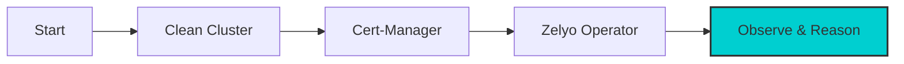

# Getting Started

Welcome to Zelyo Operator! This guide will walk you through a **from-scratch** setup on your local machine using **k3d**, **cert-manager**, and the **Zelyo Operator** Helm chart.

---

### 🗺️ Your Journey at a Glance

In about 5-10 minutes, you'll go from a blank slate to an AI-powered security scanner:



---
# What You'll Need

Before starting, make sure you have these tools installed:

| Tool | Version | Why You Need It |
|---|---|---|
| [Go](https://go.dev/dl/) | 1.24+ | Zelyo Operator is written in Go |
| [Docker](https://docs.docker.com/get-docker/) | Latest | Builds container images |
| [kubectl](https://kubernetes.io/docs/tasks/tools/) | Latest | Talks to Kubernetes clusters |
| [kind](https://kind.sigs.k8s.io/) | Latest | Creates a local Kubernetes cluster on your laptop |
| [Kubebuilder](https://kubebuilder.io/) | 4.x | Generates operator scaffolding |
| [Helm](https://helm.sh/docs/intro/install/) | 3.x | Installs Zelyo Operator into a cluster |


## 🛑 Step 0: Clean the Slates
*Progress: ⬛⬜⬜⬜⬜⬜ 0%*

To ensure no port conflicts or "leftover" processes interfere, let's start fresh:

```bash
# Delete the existing zelyo cluster if it exists
k3d cluster delete zelyo

# Optional: Prune unused networks
docker network prune -f
```

---

## 🏗️ Step 1: Create a Fresh Local Cluster
*Progress: 🟦⬛⬜⬜⬜⬜ 20%*

Create a single-node cluster named `zelyo`.

```bash
k3d cluster create zelyo
```
---
### info "What's happening here?"

k3d is launching a Kubernetes cluster inside a Docker container. It's much faster than traditional VMs.

---

## 🛡️ Step 2: Install cert-manager
*Progress: 🟦🟦⬛⬜⬜⬜ 40%*

Zelyo uses **webhooks** to intercept security violations. Webhooks require HTTPS, which means they need **TLS Certificates**. cert-manager will automate this for us.

```bash
# Install cert-manager via Helm OCI
helm install cert-manager oci://quay.io/jetstack/charts/cert-manager \
  --version v1.20.0 \
  --namespace cert-manager \
  --create-namespace \
  --set crds.enabled=true

# Wait for readiness
kubectl wait --for=condition=Ready pods --all -n cert-manager --timeout=120s
```

---


## 🚢 Step 3: Launch Zelyo Operator
*Progress: 🟦🟦🟦🟦⬛⬜ 80%*

Now, let's install the operator itself using the official OCI Helm chart.

```bash
helm install zelyo-operator oci://ghcr.io/zelyo-ai/charts/zelyo-operator \
  --namespace zelyo-system \
  --create-namespace \
  --set config.llm.provider=openrouter \
  --set config.llm.model=anthropic/claude-sonnet-4-20250514 \
  --set config.llm.apiKeySecret=zelyo-llm \
  --set webhook.certManager.enabled=true
```

### tip "Verification"

Check if the operator is running properly:

```bash
kubectl get pods -n zelyo-system
```

---

## 🔍 Step 4: Test Your First Scan
*Progress: 🟦🟦🟦🟦🟦🟦 100%*

### 4.1 Deploy a "Faulty" Pod
Deploy a deliberately insecure pod for Zelyo to find:

```bash
kubectl run insecure-nginx --image=nginx:latest --restart=Never -n default
```

### 4.2 apply a SecurityPolicy
Save this as `test-security-policy.yaml` and apply it:

```bash
apiVersion: zelyo.ai/v1alpha1
kind: SecurityPolicy
metadata:
  name: baseline-security
  namespace: zelyo-system
spec:
  severity: medium
  match:
    namespaces: ["default"]
  rules:
    - name: check-security-context
      type: container-security-context
      enforce: true
    - name: check-resource-limits
      type: resource-limits
      enforce: true
    - name: check-image-tags
      type: image-vulnerability
      enforce: false
    - name: check-privilege-escalation
      type: privilege-escalation
      enforce: true
```

```bash
kubectl apply -f test-security-policy.yaml
```

!!! ERROR "Troubleshooting: Webhook Error?"
    If you get a 404 error when applying the YAML, the OCI chart might have old paths. Run the **[Webhook Patch](troubleshooting.md#webhooks)** commands.

### 4.3 See the Results!
Wait 10 seconds, then watch the magic:

```bash
# Check the violation count
kubectl get securitypolicies -n zelyo-system

# See detailed AI reasoning
kubectl describe securitypolicy baseline-security -n zelyo-system
```

---

## 🎉 Congratulations!
You now have a fully functional **Autonomous AI Security Agent** watching over your cluster.

| Guide | What You'll Learn |
|---|---|
| [Quick Start](quickstart.md) | Common recipes for security scanning |
| [CRD Reference](crd-reference.md) | Every field in every CRD explained |
| [Architecture](architecture.md) | How the operator works under the hood |
| [Security Scanners](scanners.md) | What each scanner checks and how to configure it |
| [Monitoring & Metrics](metrics.md) | Prometheus integration and alerting |
| [GitOps Onboarding](gitops-onboarding.md) | Enable Protect Mode with automated PR fixes |
