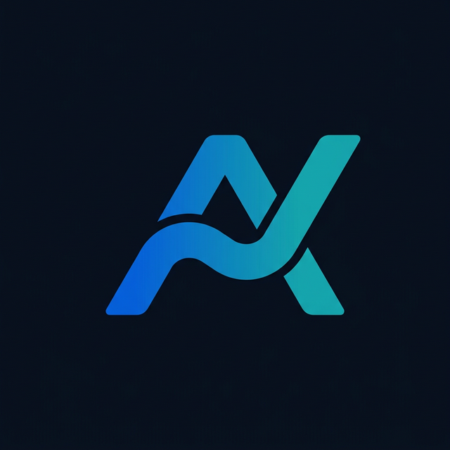
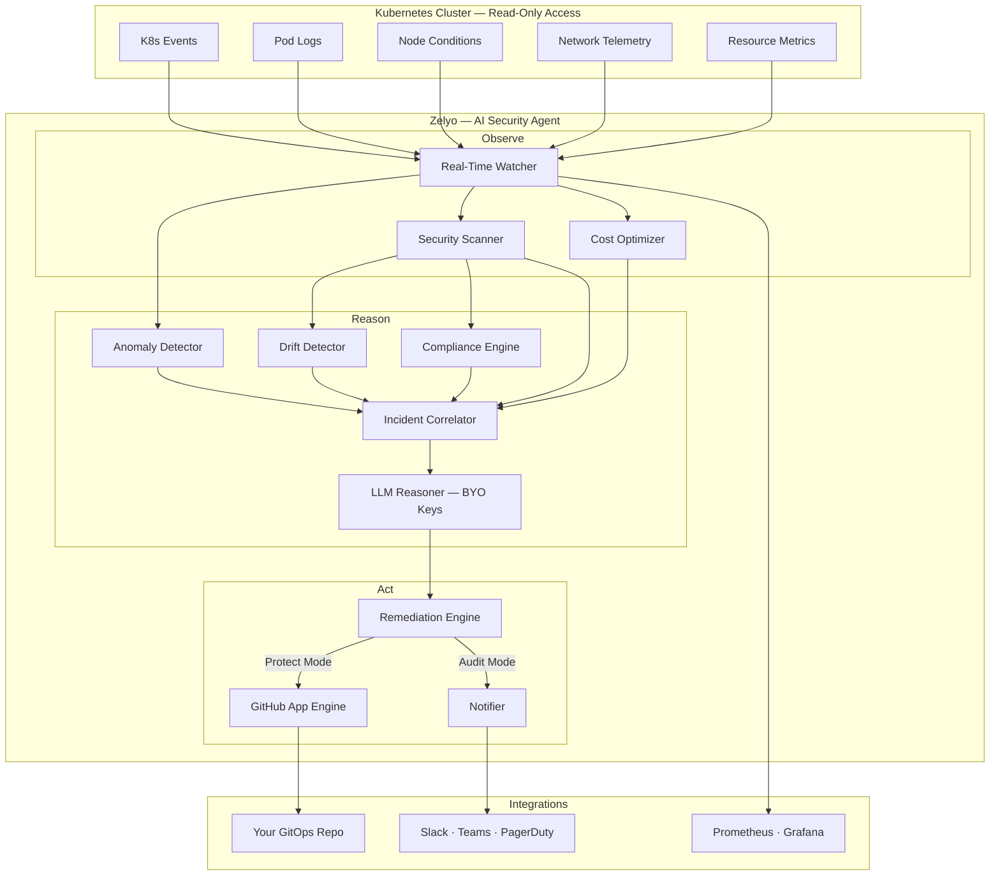

<div class="hero" markdown>

{ width="120" }

# Zelyo

<p class="hero-subtitle">Open-Source CNAPP &mdash; Autonomous AI Security Agent for Kubernetes & Cloud</p>

<div class="badges">
  <a href="https://github.com/zelyo-ai/zelyo-operator/actions/workflows/ci.yml"></a>
  <a href="https://github.com/zelyo-ai/zelyo-operator/releases"></a>
  <a href="https://goreportcard.com/report/github.com/zelyo-ai/zelyo-operator"></a>
  <a href="https://github.com/zelyo-ai/zelyo-operator/blob/main/LICENSE"></a>
</div>

<div class="hero-actions">
  <a href="quickstart/" class="primary-btn">🚀 Get Started</a>
  <a href="https://github.com/zelyo-ai/zelyo-operator" class="secondary-btn">⭐ View on GitHub</a>
</div>

</div>

---

## What is Zelyo?

**Zelyo** is an open-source **Cloud-Native Application Protection Platform (CNAPP)** that operates as an **autonomous AI security agent**. It scans **56 security checks** across Kubernetes workloads and cloud infrastructure (AWS, with GCP/Azure expanding), **correlates** signals with AI, and **auto-generates remediation code as GitOps PRs** — the only open-source tool that closes the loop from detection to fix.

Every other scanner (Prowler, Trivy, Kubescape) stops at detection. Zelyo generates the fix, opens the PR, and waits for your approval. **Human-in-the-loop. Production-safe. Read-only by default.**

**Bring your own LLM API keys** (OpenRouter, OpenAI, Anthropic, Azure, Ollama) — optimized for minimal token usage.

---

## Key Features

<div class="feature-grid" markdown>

<div class="feature-card" markdown>
<div class="feature-icon">🔒</div>

### 56 Security Scanners
8 K8s scanners (RBAC, images, PodSecurity, secrets, network) + 48 cloud scanners (CSPM, CIEM, Network, DSPM, Supply Chain, CI/CD Pipeline).
</div>

<div class="feature-card" markdown>
<div class="feature-icon">🛡️</div>

### Compliance
CIS Benchmarks, NSA/CISA hardening, PCI-DSS, SOC2, and HIPAA compliance mapping with automated checks.
</div>

<div class="feature-card" markdown>
<div class="feature-icon">☁️</div>

### Multi-Cloud CNAPP
Onboard AWS accounts via CloudAccountConfig. 48 checks across CSPM, CIEM, Network, DSPM, Supply Chain, and CI/CD Pipeline. SOC 2, PCI-DSS, HIPAA compliance mapping.
</div>

<div class="feature-card" markdown>
<div class="feature-icon">⚡</div>

### Real-Time Monitoring
24/7 Kubernetes events, pod logs, node conditions, and network telemetry with anomaly detection.
</div>

<div class="feature-card" markdown>
<div class="feature-icon">🧠</div>

### Agentic AI Remediation
LLM-powered diagnosis with structured JSON fix plans, risk scoring, and production-ready GitOps PRs via GitHub App.
</div>

<div class="feature-card" markdown>
<div class="feature-icon">💰</div>

### Cost Optimization
Resource rightsizing, idle workload detection, and spot-readiness assessment to reduce cloud spend.
</div>

<div class="feature-card" markdown>
<div class="feature-icon">🔄</div>

### Config Drift Detection
Compares live cluster state against your GitOps repo manifests and auto-generates reconciliation PRs.
</div>

<div class="feature-card" markdown>
<div class="feature-icon">🚨</div>

### Runtime Threat Detection
Suspicious exec detection, privilege escalation, filesystem anomalies, and lateral movement detection.
</div>

<div class="feature-card" markdown>
<div class="feature-icon">🌐</div>

### Multi-Cluster Federation
Aggregate views, cross-cluster correlation, and centralized policy management across all your clusters.
</div>

</div>

---

## Dual Operating Modes

| Mode | When | Behavior |
|---|---|---|
| **:material-magnify: Audit Mode** (default) | `ZelyoConfig.spec.mode: audit` | Detects, diagnoses, and sends alerts. The remediation engine runs in `dry-run` — fix plans are logged but no PRs are opened. Zero cluster modifications. |
| **:material-shield-check: Protect Mode** | `ZelyoConfig.spec.mode: protect` **and** at least one `RemediationPolicy` targeting a `GitOpsRepository` | Switches the remediation engine to the `gitops-pr` strategy. The `RemediationPolicy` controller drives PR creation — `severityFilter` gates which incidents qualify, `maxConcurrentPRs` caps the number of open Zelyo PRs on the target repo. |

!!! note
    `ZelyoConfig.spec.mode: protect` only flips the engine strategy from `dry-run` to `gitops-pr`. **No PRs are opened until you also create at least one `RemediationPolicy` that points at a `GitOpsRepository`.** See [GitOps Onboarding](gitops-onboarding.md) for the full setup.

---

## Architecture



---

## Quick Install

=== "Helm (OCI)"

    ```bash
    # Create namespace and LLM secret
    kubectl create namespace zelyo-system
    kubectl create secret generic zelyo-llm \
      --namespace zelyo-system \
      --from-literal=api-key=<YOUR_API_KEY>

    # Install from OCI registry
    helm install zelyo-operator oci://ghcr.io/zelyo-ai/charts/zelyo-operator \
      --namespace zelyo-system \
      --set config.llm.provider=openrouter \
      --set config.llm.model=anthropic/claude-sonnet-4-20250514 \
      --set config.llm.apiKeySecret=zelyo-llm
    ```

=== "Kustomize"

    ```bash
    kubectl apply -k https://github.com/zelyo-ai/zelyo-operator/config/default
    ```


---

<p align="center" style="margin-top: 3rem; color: var(--md-default-fg-color--lighter);">
  Created with ❤️ by <a href="https://zelyo.ai">Zelyo AI</a>
</p>
