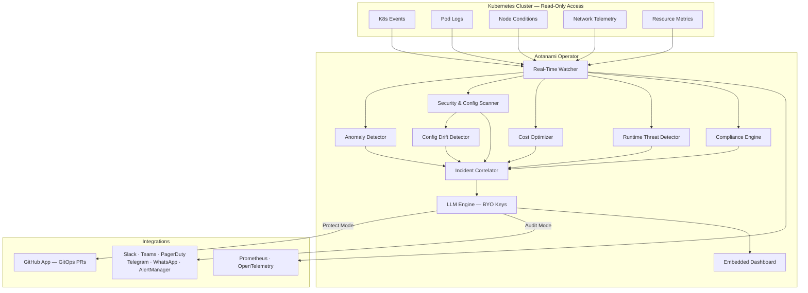

---
hide:
  - navigation
  - toc
---

<div class="hero" markdown>

{ width="120" }

# Aotanami

<p class="hero-subtitle">Autonomous Kubernetes Protection — Powered by Agentic AI</p>

<div class="badges">
  <a href="https://github.com/aotanami/aotanami/actions/workflows/ci.yml"></a>
  <a href="https://github.com/aotanami/aotanami/releases"></a>
  <a href="https://goreportcard.com/report/github.com/aotanami/aotanami"></a>
  <a href="https://github.com/aotanami/aotanami/blob/main/LICENSE"></a>
</div>

<div class="hero-actions">
  <a href="getting-started/" class="primary-btn">🚀 Get Started</a>
  <a href="https://github.com/aotanami/aotanami" class="secondary-btn">⭐ View on GitHub</a>
</div>

</div>

---

## What is Aotanami?

Aotanami is a **self-hosted, lightweight Kubernetes Operator** that uses **Agentic AI** to provide complete **360° protection** for your production clusters. It autonomously detects security vulnerabilities, misconfigurations, cost anomalies, and runtime threats — then proposes **production-ready fixes via GitOps**, all with **read-only cluster access**.

**Bring your own LLM API keys** (OpenRouter, OpenAI, Anthropic) — Aotanami is heavily optimized to minimize token usage and keep costs low.

---

## Key Features

<div class="feature-grid" markdown>

<div class="feature-card" markdown>
<div class="feature-icon">🔒</div>

### Security Scanning
RBAC audit, image vulnerabilities, PodSecurity violations, secrets exposure, and network policy gaps.
</div>

<div class="feature-card" markdown>
<div class="feature-icon">🛡️</div>

### Compliance
CIS Benchmarks, NSA/CISA hardening, PCI-DSS, SOC2, and HIPAA compliance mapping with automated checks.
</div>

<div class="feature-card" markdown>
<div class="feature-icon">🔗</div>

### Supply Chain Security
SBOM analysis, image signature verification (Cosign/Notary), and base image CVE tracking.
</div>

<div class="feature-card" markdown>
<div class="feature-icon">⚡</div>

### Real-Time Monitoring
24/7 Kubernetes events, pod logs, node conditions, and network telemetry with anomaly detection.
</div>

<div class="feature-card" markdown>
<div class="feature-icon">🧠</div>

### Agentic AI Remediation
LLM-powered diagnosis with production-ready fix PRs via GitHub App. BYO API keys, optimized for low token usage.
</div>

<div class="feature-card" markdown>
<div class="feature-icon">💰</div>

### Cost Optimization
Resource rightsizing, idle workload detection, and spot-readiness assessment to reduce cloud spend.
</div>

<div class="feature-card" markdown>
<div class="feature-icon">🔄</div>

### Config Drift Detection
Compares live cluster state against your GitOps repo manifests and auto-generates reconciliation PRs.
</div>

<div class="feature-card" markdown>
<div class="feature-icon">🚨</div>

### Runtime Threat Detection
Suspicious exec detection, privilege escalation, filesystem anomalies, and lateral movement detection.
</div>

<div class="feature-card" markdown>
<div class="feature-icon">🌐</div>

### Multi-Cluster Federation
Aggregate views, cross-cluster correlation, and centralized policy management across all your clusters.
</div>

</div>

---

## Dual Operating Modes

| Mode | When | Behavior |
|---|---|---|
| **:material-magnify: Audit Mode** (default) | No GitOps repo onboarded | Detects, diagnoses, and sends alerts — zero cluster modifications |
| **:material-shield-check: Protect Mode** | GitOps repo onboarded | Full autonomous remediation — generates fixes, opens PRs via GitHub App |

---

## Architecture



---

## Quick Install

=== "Helm (OCI)"

    ```bash
    # Create namespace and LLM secret
    kubectl create namespace aotanami-system
    kubectl create secret generic aotanami-llm \
      --namespace aotanami-system \
      --from-literal=api-key=<YOUR_API_KEY>

    # Install from OCI registry
    helm install aotanami oci://ghcr.io/aotanami/charts/aotanami \
      --namespace aotanami-system \
      --set config.llm.provider=openrouter \
      --set config.llm.model=anthropic/claude-sonnet-4-20250514 \
      --set config.llm.apiKeySecret=aotanami-llm
    ```

=== "Kustomize"

    ```bash
    kubectl apply -k https://github.com/aotanami/aotanami/config/default
    ```

[Full installation guide :material-arrow-right:](getting-started.md){ .md-button }

---

<p align="center" style="margin-top: 3rem; color: var(--md-default-fg-color--lighter);">
  Built with ❤️ by <a href="https://zelyo.ai">Zelyo AI</a>
</p>
